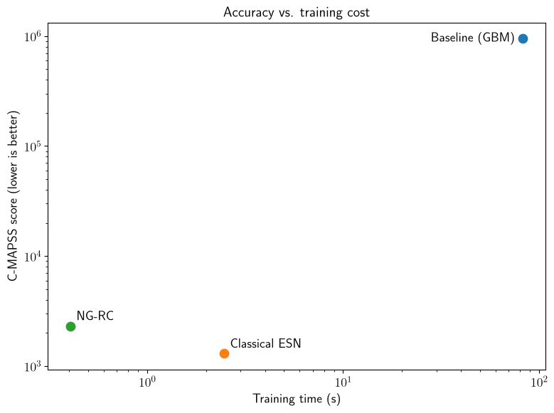

# Predictive Maintenance via Reservoir Computing

Compares a gradient-boosting baseline, a classical Echo State Network, and NG-RC
(next-generation reservoir computing) on NASA's C-MAPSS FD004 turbofan degradation benchmark —
the hardest of the four standard subsets (6 operating conditions, 2 simultaneous fault modes).

## Results

Remaining-useful-life prediction on the FD004 test set. The C-MAPSS score penalises late
predictions (overestimating remaining life) far more heavily than early ones, so it, not
RMSE, is the metric that reflects maintenance risk.

| Model | Train time | RMSE | C-MAPSS score |
|---|---:|---:|---:|
| Gradient boosting (tuned) | 82.54 s | 58.17 | 953,274 |
| Classical ESN (tuned) | 2.47 s | **16.38** | **1,299** |
| NG-RC (tuned) | **0.41 s** | 21.08 | 2,315 |

Both reservoir methods beat the tuned baseline by nearly three orders of magnitude on the
score (734x for the ESN, 412x for NG-RC). NG-RC trains 6x faster than the ESN and 200x
faster than the baseline, and does so deterministically — no random reservoir to reseed —
at a cost of about 4.7 RMSE against the ESN.



Predictions come with 90% split-conformal intervals (±32.5 cycles for the ESN, ±35.5 for
NG-RC).

**Full write-up**: [WRITEUP.md](WRITEUP.md) — dataset, models, evaluation, results, and the
tuning and debugging investigations. [SUMMARY.md](SUMMARY.md) for a short version.

## Install

```
python3 -m venv venv
source venv/bin/activate
pip install -e ".[dev]"
```

## Get the data

Download `CMAPSSData.zip` from the NASA Open Data Portal:
https://data.nasa.gov/dataset/cmapss-jet-engine-simulated-data

Extract `train_FD004.txt`, `test_FD004.txt`, and `RUL_FD004.txt` into `data/`. (The zip contains
all four subsets — FD001-FD004; this project's default pipeline uses FD004 only. `rcpm.data`
supports any subset via `load_cmapss(subset)`.)

To keep the dataset outside the repo, point `RCPM_DATA_DIR` at it instead:

```
export RCPM_DATA_DIR=/path/to/cmapss
```

## Running things

Commands work from any directory once installed.

**Full three-way comparison** (baseline, tuned ESN, tuned NG-RC — the numbers above):

```
rcpm-compare
```

Saves figures to `results/`. `rcpm-plot` redraws those same figures from the saved
`results_*.pkl` without refitting anything, and `maintenance_alert_demo` reads that same pkl
to produce `WRITEUP.md`'s Table 3 worked example — run `rcpm-compare` at least once first.

**Console scripts:**

```
rcpm-compare          # full three-way comparison
rcpm-plot             # redraw figures from the saved pkl, no refitting
rcpm-tune-baseline    # 30-config randomized search for the baseline (~9 min)
rcpm-tune-esn         # ESN hyperparameter grid search
rcpm-tune-ngrc        # NG-RC hyperparameter grid search
```

**Everything else** runs as a module:

```
python -m rcpm.eda                                  # informative-sensor selection, trajectory plot
python -m rcpm.experiments.plot_normalization_demo  # per-condition normalization figure
python -m rcpm.experiments.lightgbm_baseline        # LightGBM on the same features, model-family check
python -m rcpm.experiments.seed_sensitivity_esn     # ESN spread across 100 seeds (~7 min)
python -m rcpm.experiments.kfold_ngrc_check         # 5-fold CV check of NG-RC's n_lags (~15s)
python -m rcpm.experiments.n_lags_test_sweep        # test-set score across n_lags 2-40 (~20s)
python -m rcpm.experiments.maintenance_alert_demo   # Table 3 worked example, needs the pkl first
```

`kfold_ngrc_check` re-tests NG-RC's `n_lags` candidates (`degree=1`, `ridge_alpha` fixed at
its established plateau value) under 5-fold, unit-level cross-validation, to check whether the
single-split tuning tie in `WRITEUP.md` holds up under a more robust split — see the "K-fold
check" subsection of `WRITEUP.md` for the result.

The figures use LaTeX text rendering, so plotting needs a working LaTeX installation.

## Tests

```
pytest
```

Tests that need the dataset skip automatically when `data/` is empty.

## `ESN_tests/`

A self-contained, isolated investigation (no imports from `src/`, no modification of anything
outside its own directory) into an ESN hyperparameter question. See `ESN_tests/README.md`.

## Other docs

- [PLAN.md](PLAN.md) — the original project plan (written for an earlier, smaller scope; kept
  for history, superseded by `WRITEUP.md` for what actually happened)

## Layout

```
data/                     # raw C-MAPSS files (gitignored — see "Get the data" above)
src/rcpm/                 # library: data, features, models, metrics, plotting
src/rcpm/experiments/     # runnable experiments and hyperparameter searches
tests/                    # pytest suite
ESN_tests/                # isolated diagnostic, self-contained
results/                  # generated figures
```
